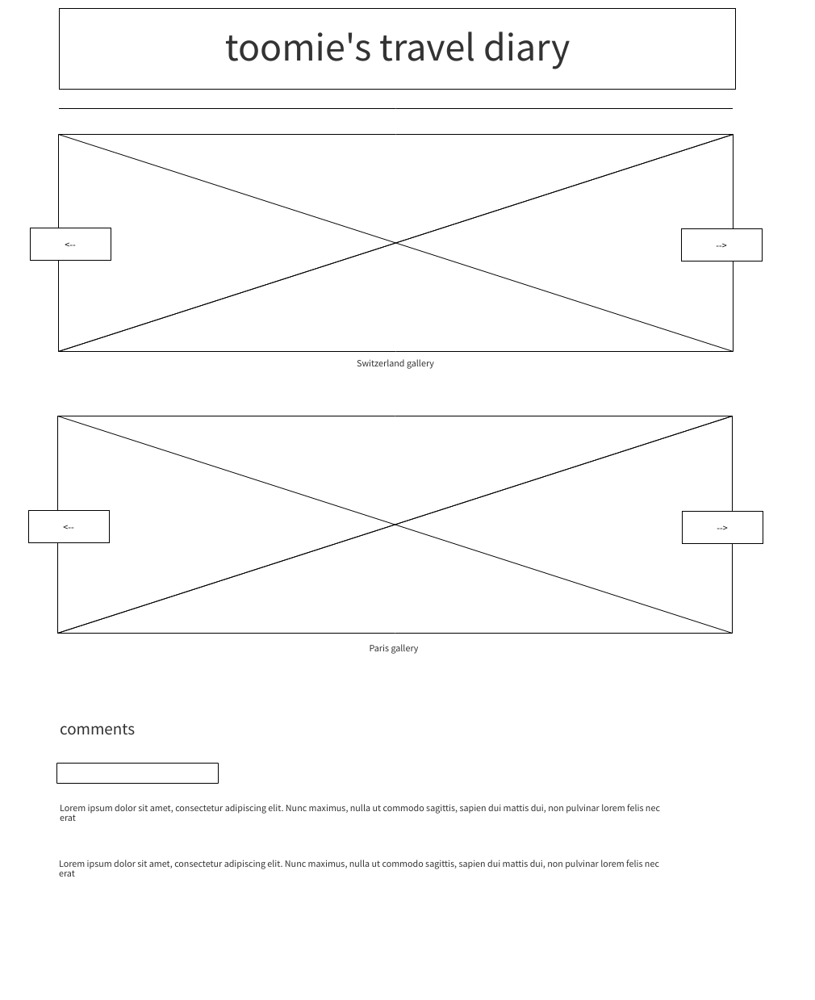
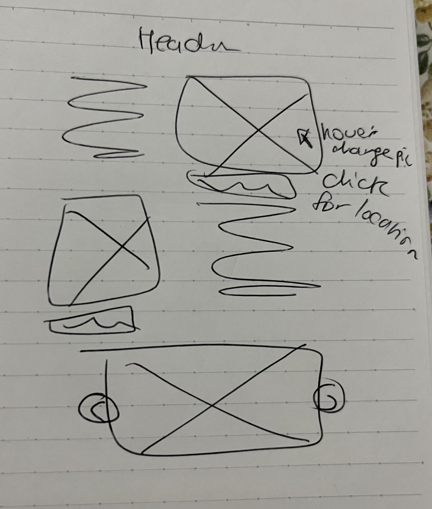

## Travel Diary
### Homework Week2 - Javascript interaction 
Webpage link: https://oomie.github.io/connectionslab/traveldiary/
(the link is not working for me and im not sure how to fix it)

This week, our assignment was to make a webpage with javascript interaction elements. 
I decided to make a little travel diary, initially with two image galleries and a “comment section” similar to the to do list example.
I followed a youtube tutorial to make the gallery, but used swiper.js for it so I wasn’t sure if that counts. I ended up leaving the gallery at the bottom and adding a few pictures with captions below the header. When your mouse hovers on the images, they change to show another image from the same location. When you click on these images, an alert pops up that tells you where these pictures were taken. I decided to keep the swiper.js gallery at the bottom because I thought it would be a fun addition nonetheless. I also linked two google fonts to use in my webpage, one for headers/titles and the other for body text. There is a favicon as well!

## Wireframes
Here's my inital wireframe:

  
  
  As you can see, my initial plan is quite different from the final product - there were two image galleries and a comment section here, but after a few hours of coding, that didn't work out so I went back to the drawing board and came up with this wireframe:
  
  
  
  Quite similar to my final product, but I scrapped the zigzag layout for 3 images and their captions below them, and I positioned these elements with css grid. I programmed the hover image switch and the location alert with javascript. I added a footer so it looks more like a real blog, and thats it! 

